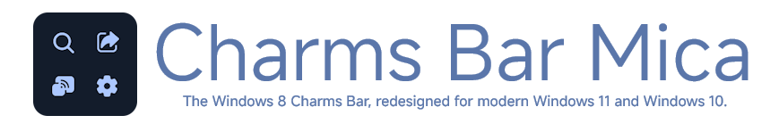
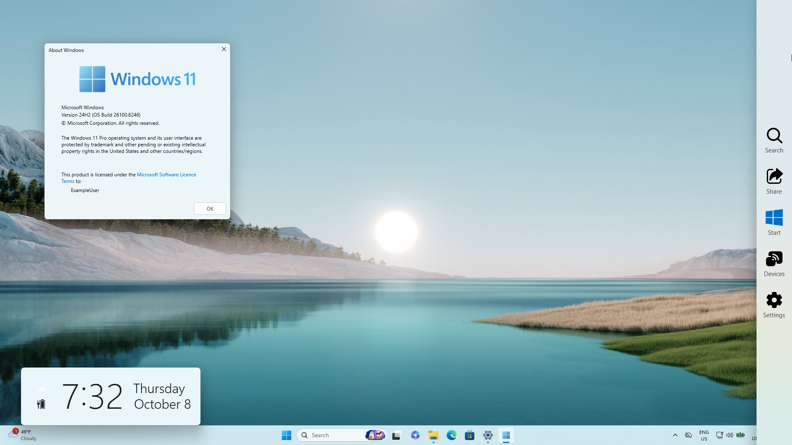
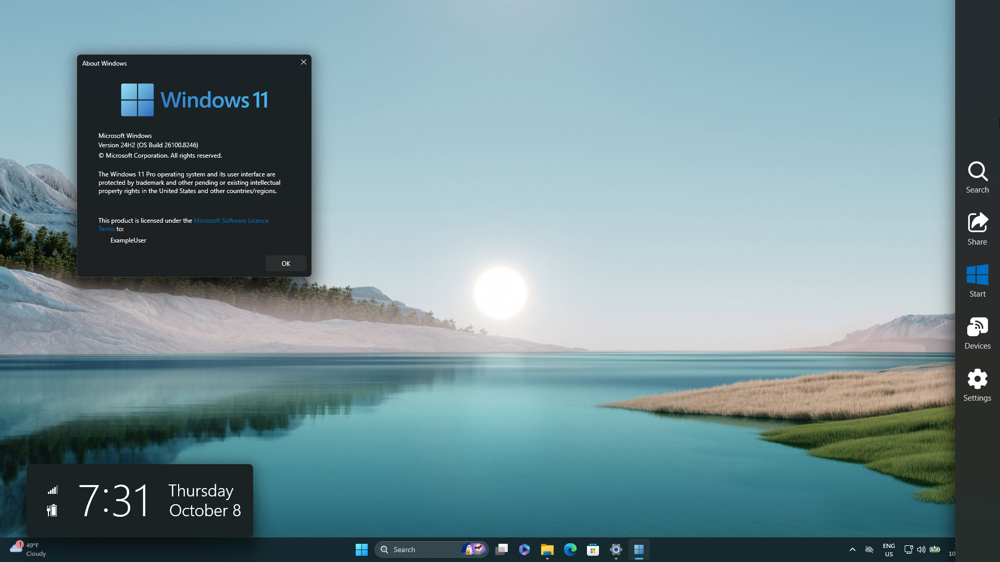
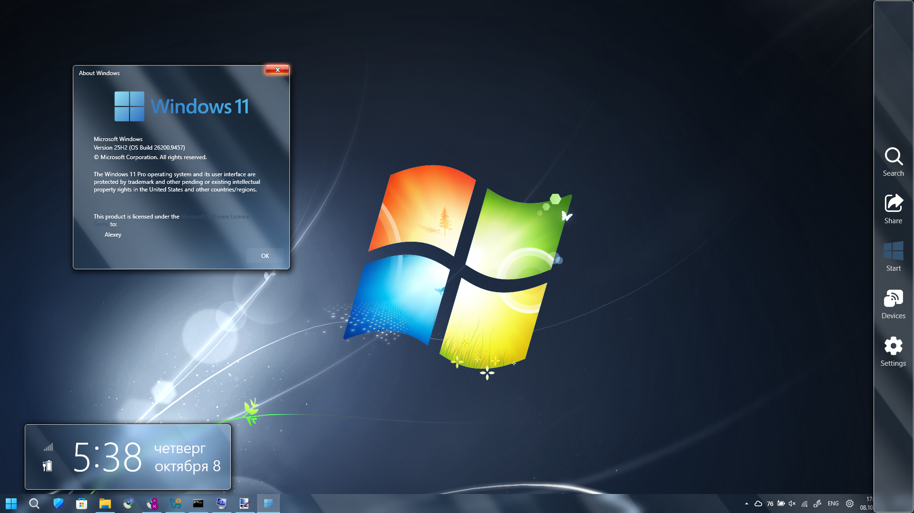
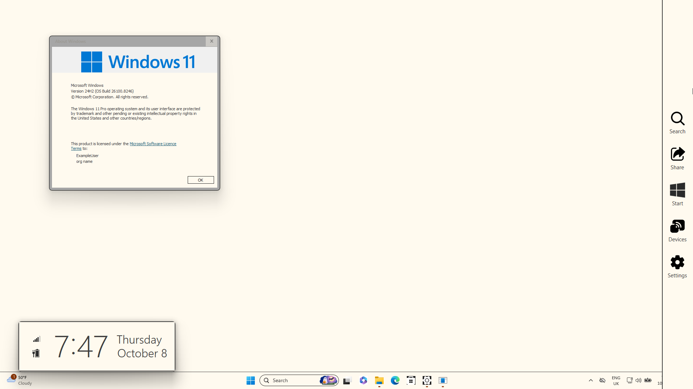
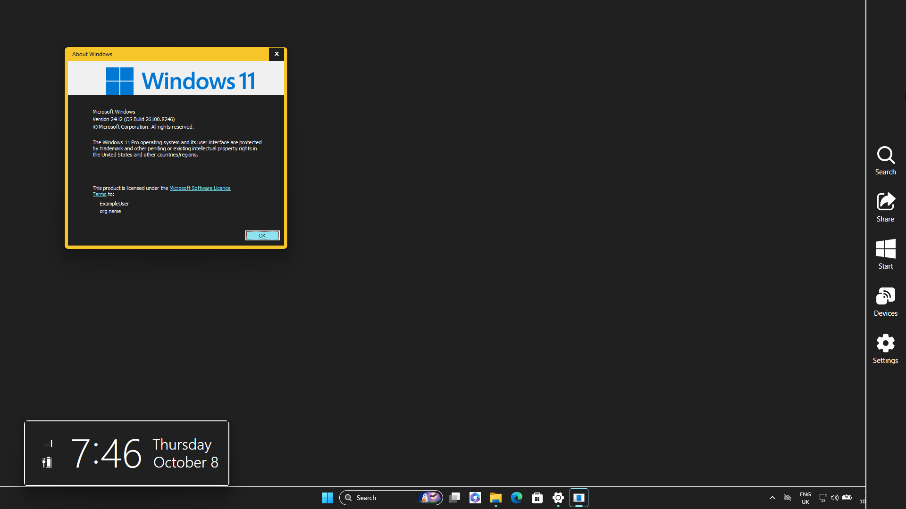

  

<blockquote>
  "Your most unhappy customers are your greatest source of learning." 
  — Bill Gates
</blockquote>

## Contents

* [About](#about)
* [Why was this created?](#why-was-this-created)
* [How does it work?](#how-does-it-work)
* [Requirements](#requirements)
* [Features](#features)
* [Supported languages](#supported-languages)
* [Screenshots](#screenshots)
* [Download](#download)
* [Q&As](#qas)
* [License](#license)
* [Disclaimer](#disclaimer)
* [Support](#support)

## About

<b>Charms Bar Mica</b> is an unofficial Windows 11 Mica/Fluent-inspired continuation of the classic Windows 8.x Charms Bar, designed to feel more native on modern Windows systems while preserving the familiar behavior and look of the original design.

It brings the iconic Charms Bar experience back to Windows 10 and Windows 11 with a refreshed visual style designed to fit naturally into a modern desktop environment.

This project is a fork of the original repository, <a href="https://github.com/Icepenguins101/charms-bar-port">Charms Bar Port</a>, with enhancements focused on making the Windows 8/8.1 experience feel more native on Windows 10 and Windows 11 through Mica-inspired visuals, Fluent-inspired styling, modern colors, and closer visual integration with the OS.

Charms Bar Mica is an independent, unofficial project and is not affiliated with or endorsed by the original project's author or by Microsoft.

## Why was this created?

As you may know, the original Charms Bar Port had not received an update since approximately 2024 and had never received an official release package. There was no actively maintained alternative that provided the same experience.

Why wouldn't I just fork, build and use it for myself only?

Because Icepenguins101 made CharmsMenu and CharmsClock in a way that allowed my OpenGlass setup to bring back the ✨aero✨ look of the Charms Bar.

For these reasons, I've decided to make the Charms Bar look and feel more native on modern Windows.

Yeah, that simple.

## How does it work?

On touch screens, you should be able to swipe from the right edge towards the center to bring up the Charms Bar. (Work in progress)

If you're a mouse user, move your cursor to the top-right corner and drag it down to open the Charms Bar.

You can also use the keyboard shortcut Windows key + C, just like it was on Windows 8.x. This shortcut is temporarily disabled.

Included in the Charms Bar are:

 

<b>Search:</b> Opens the search bar from the taskbar on Win32 programs (easily remappable to function as <a href="https://github.com/srwi/EverythingToolbar">EverythingToolbar</a>, perhaps even more programs that support hotkeys), or, on supported Metro/UWP apps, brings up their Search charm. 

<b>Share:</b> Opens the Share charm. 

<b>Start:</b> Opens the Start menu/screen. If you are using <a href="https://github.com/Open-Shell/Open-Shell-Menu">Open-Shell</a>, you can remap this button to open its Start menu instead or completely disable its functionality. 

<b>Devices:</b> Opens the Connect charm. On supported Metro/UWP apps, it opens the print dialog. 

<b>Settings:</b> Opens the Settings app on Win32 programs or the Settings charm on supported Metro/UWP apps.

## Requirements

* <b>Windows 11</b> (recommended) or Windows 10
* <a href="https://dotnet.microsoft.com/en-us/download/dotnet/7.0">.NET 7.0</a>

## Features

### New

* Native DWM window rendering
* Fully supports DWMBlurGlass and OpenGlass
* Mica by default on Windows 11

### Already included

* Powered by Visual Studio 2022
* Based on Windows 8.1 Update 3
* Formatting-aware (uses the OS time and date formats; custom formats are not supported yet)
* Language-aware (automatically switches depending on your OS language)
* Uses accent colors from your system
* Network and battery status icons included
* Supports Windows 8.x-era registry keys
* Supports high contrast and light/dark mode preferences
* Fully animated to emulate Windows 8.x (can be disabled in the OS settings)
* Multi-monitor support (please read <a href="https://raw.githubusercontent.com/Kotofey008/charms-bar-mica/main/resource/helpwanted.txt">this</a>)
* Touch-friendly
* Customizable panels (can be removed through the Registry Editor)
* Fully designable: includes a Windows 7 Metro concept, Windows 8 Developer Preview, Windows 8.1 Update 3, Windows 11 Metro concept and Windows 11 Fluent concept styles by default, or you can define your own custom theme
* Pin anything to the Charms Bar for easy access
* Switch between Win32 and Metro modes for the currently focused program

## Supported languages

* English
* Russian (русский) (will be added in the next major update)

I don't know any other language, so there'll be only these two for now.

## Screenshots

<b>These screenshots are currently outdated and will be replaced.</b>

## Download

[GitHub Releases](https://github.com/Kotofey008/charms-bar-mica/releases)

## Q&As

### Q: Is this repository the complete edition of Charms Bar Port?

A: No. This project is <b>IN DEVELOPMENT</b> and should not be used by inexperienced users or as a daily driver without understanding the risks involved.

 

### Q: How does this fork look like on Windows 10?

A: Exactly the same as the original <a href="https://github.com/Icepenguins101/charms-bar-port">Charms Bar Port</a>, except for new Fluent UI icons.

 

### Q: How can I disable the Charms Bar hot corners without closing the program?

A: This requires editing the Windows Registry. I am not responsible for damage caused by incorrect registry modifications.

1. Press <b>WIN+R</b> to launch the Run dialog, type <code>regedit</code> and press Enter.

2. Navigate to:

   <code>HKEY_CURRENT_USER\Software\Microsoft\Windows\CurrentVersion\ImmersiveShell</code>

3. Under the <code>ImmersiveShell</code> key, create a new key called <code>EdgeUI</code>.

4. Select <code>EdgeUI</code> and create two new DWORD values named <b>DisableTRCorner</b> and <b>DisableBRCorner</b>, setting both values to <code>1</code>.

   Alternatively, create a DWORD named <b>DisableCharmsHint</b> and set its value to <code>1</code>.

5. The hot corners will be disabled immediately. No logoff or restart is required.

To revert the change, set the values back to <code>0</code> or delete the corresponding DWORD values.

 

### Q: When will this be released?

A: Beta releases are already available on [GitHub Releases](https://github.com/Kotofey008/charms-bar-mica/releases). This is not a stable release, so keep that in mind.

 

### Q: I'm using a touch screen. Why does the Action Center always open with the Charms Bar?

A: This is because the Action Center uses the same gesture. Disable that gesture first to start using the Charms Bar on a tablet or touch-enabled PC.

 

### Q: How can I switch to the Windows 10 Technical Preview style?

A: For a true Windows 10 Technical Preview style, stay on the Windows 8.1 Charms Bar theme and edit the Windows Registry. I am not responsible for damage caused by incorrect registry modifications.

1. Press <b>WIN+R</b> to launch the Run dialog, type <code>regedit</code> and press Enter.

2. Navigate to:

   <code>HKEY_CURRENT_USER\Software\Microsoft\Windows\CurrentVersion\ImmersiveShell</code>

3. Under the <code>ImmersiveShell</code> key, create a new key called <code>EdgeUI</code>.

4. Select <code>EdgeUI</code> and create a DWORD named <b>DisableSettingsCharm</b>, setting its value to <code>1</code>.

5. The Settings panel will be removed from the Charms Bar, emulating the Windows 10 Technical Preview style.

No logoff or restart is required. To revert the change, set the value back to <code>0</code> or delete the DWORD.

 

### Q: Win+[ is taken. Can you use another hotkey?

A: Well, this is the only hotkey I've found unassigned for anything. If you have it taken... How?

 

### Q: Is this safe to use?

A: It should be safe to use, but this is an unofficial project under active development. Always download releases from sources you trust (aka. [GitHub Releases](https://github.com/Kotofey008/charms-bar-mica/releases)) and review the source code if you have concerns.

 

### Q: Why are the animations stiff?

A: I'm still improving the animations, so they may not perfectly match the original Windows 8.x behavior.

 

### Q: Why does this program not support Windows 7 and Windows 8.1?

A: Charms Bar Mica is designed for Windows 10 and Windows 11. Windows 8.1 already includes the original Charms Bar, while Windows 7 is outside the project's current scope.

 

### Q: How does multi-monitor support work?

A: If you have two or more monitors, moving your mouse to another monitor changes the activeScreen parameter (activeScreen = 0 is monitor 1, activeScreen = 1 is monitor 2, and so on), moving the Charms Bar to the corresponding screen.

If it is activated by mouse but has not completely expanded, moving to another monitor forces the Charms Bar to deactivate. This fixes a bug in the original version where the Charms Bar could remain visible on the previous monitor.

 

### Q: I'm trying to ALT+F4 the program but it won't let me. Why?

A: This is a workaround to fix a crash bug. Use Task Manager if you need to stop the program.

 

### Q: Why is it lagging on my machine?

A: The network icon in Charms Clock uses the command prompt to receive network information. Performance improvements are still being worked on. I'll probably disable it completely in the future if I don't find a solution.

 

### Q: Why is it flickering on my machine?

A: This may be hardware-specific. If you can reproduce the problem, please report it through the GitHub Issues page with your hardware and Windows version.

 

### Q: Can I fork this repository and release my own version?

A: The original repository does not provide a license for its code. This project only grants rights to original material contributed by Kotofey008 under the license described in [LICENSE.md](LICENSE.md).

Material originating from the original Charms Bar Port repository or other third parties is not relicensed by this project.

 

### Q: Will you do more ports from Windows 8.1?

A: I'd like to try porting more Windows 8.1 features to modern Windows, including hot corners with proper animations and potentially the Start Screen.

 

### Q: Will there be a version for macOS, Linux and HaikuOS?

A: Maybe. I'd like to experiment with other platforms in the future, but Windows is currently the main target.

 

### Q: How can I contact you?

A: You can report bugs, suggest features, or discuss contributions through the [GitHub Issues](https://github.com/Kotofey008/charms-bar-mica/issues) page or by sending me an [email](mailto:contact@mail.0nl.ru).

## License

Original work contributed by <b>Kotofey008</b> is licensed under the <a href="LICENSE.md">PolyForm Noncommercial License 1.0.0</a>.

This license applies only to material that Kotofey008 is legally entitled to license.

It does <b>not</b> grant any license to code, assets, documentation, or other material originating from the original Charms Bar Port repository or other third parties.

See <a href="LICENSE.md">LICENSE.md</a> for details.

## Disclaimer & Third-party notices

<b>Charms Bar Mica is an unofficial project.</b>

It is not affiliated with, endorsed by, sponsored by, or otherwise officially connected to Microsoft Corporation.

Windows, Windows 10, Windows 11, and other Microsoft product names and logos are trademarks or registered trademarks of Microsoft Corporation.

The use of the terms "Windows", "Mica", "Fluent", and other Microsoft terminology in this project is descriptive and refers to compatibility, inspiration, or design concepts. It does not imply endorsement by Microsoft.

Charms Bar Port
Copyright © Icepenguins101 and respective contributors.
Used as the basis of this project.

Fluent UI System Icons
Copyright © Microsoft Corporation.
Licensed under the <a href="LICENSE-MIT.txt">MIT License</a>.

MiSans
Copyright © Xiaomi Corporation.
Used under the <a href="LICENSE-MISANS.pdf">MiSans Font License</a>.

## Support

Are you interested in Charms Bar Mica and want to help out? Here are some options.

### Programmer

Code contributions are welcome.

If you can improve existing functionality, port Windows 8.1 features, improve multi-monitor support, optimize performance, or help with the modern Windows integration, please open an issue or submit a pull request.

Please make sure that your contributions contain code or other material that you are legally entitled to contribute under the project's licensing terms.

### Localization

Help translate Charms Bar Mica into more languages.

If you want to add a language that isn't currently supported, open an issue or submit a pull request.

### Suggestions & Bug Reports

Suggest new features or report bugs through the [GitHub Issues](https://github.com/Kotofey008/charms-bar-mica/issues) page.

### Spread the word

Star this repository, leave a review of the program on your website, or share it with others who want the Windows 8.x experience back.

### Donations

No.